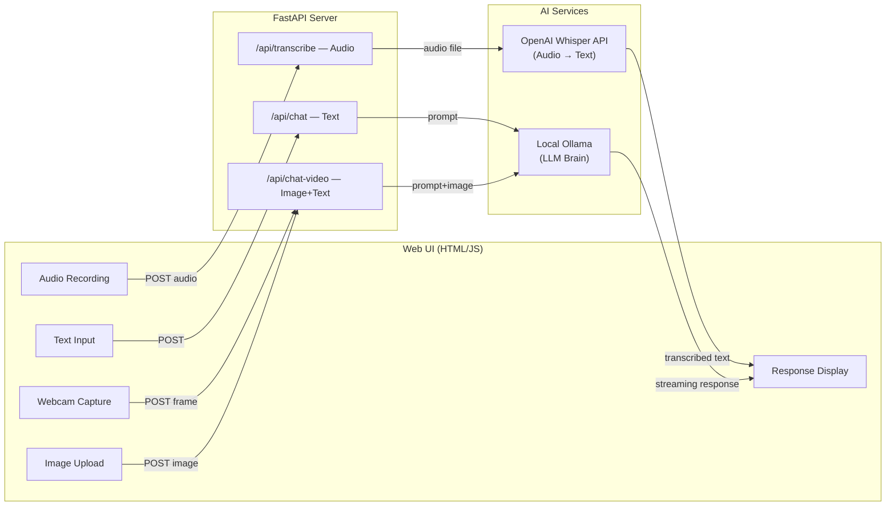

# 🤖 Personal Assistant

A web-based personal AI assistant with multiple input modes — text, voice, webcam, and image upload — powered by a local Ollama LLM and OpenAI Whisper for audio transcription.

## Architecture



## Prerequisites

- **Python 3.9+**
- **Node.js 16+** (for building TypeScript)
- **Ollama** running locally — https://ollama.com
- **OpenAI API key** (for Whisper audio transcription)

### Pull Ollama models

```bash
# Text model (default)
ollama pull gemma4

# Vision model (default) — for webcam/image features
ollama pull qwen3.5:9b
```

## Setup & Run

### 1. Install dependencies

```bash
# Python
pip install -r requirements.txt

# TypeScript build tools
npm install
```

### 2. Build the frontend

```bash
npm run build
```

For development with auto-rebuild on file changes:

```bash
npm run watch
```

### 3. Set environment variables

```bash
export OPENAI_API_KEY="your-openai-api-key"
```

### 4. Start the server

```bash
python3 -m uvicorn app:app --reload --host 0.0.0.0 --port 8000
```

Open **http://localhost:8000** in your browser.

## Changing LLM Models

All models are configurable via environment variables:

| Variable | Default | Description |
|---|---|---|
| `OLLAMA_MODEL` | `gemma4` | Text chat model |
| `OLLAMA_VISION_MODEL` | `qwen3.5:9b` | Vision model (webcam & image upload) |
| `OLLAMA_BASE_URL` | `http://localhost:11434` | Ollama server URL |
| `OPENAI_API_KEY` | *(none)* | Required for audio transcription |

### Examples

```bash
# Use a different text model
export OLLAMA_MODEL="llama3.2"

# Use a different vision model
export OLLAMA_VISION_MODEL="llava"

# Point to a remote Ollama instance
export OLLAMA_BASE_URL="http://192.168.1.100:11434"
```

Then restart the server to apply changes.

## Input Modes

| Mode | Button | Description |
|---|---|---|
| **Text** | ➤ | Type a message and press Enter or click send |
| **Voice** | 🎤 | Click to start recording, click again to stop. Audio is transcribed via OpenAI Whisper, then sent to the LLM |
| **Webcam** | 📷 | Opens camera preview. Optionally type a question, then click "Capture & Ask" |
| **Image Upload** | 🖼️ | Pick an image file from disk. Optionally type a question before clicking |

## Project Structure

```
personalHelper/
├── app.py               # FastAPI backend
├── requirements.txt     # Python dependencies
├── package.json         # Node.js build scripts
├── tsconfig.json        # TypeScript config
├── src/
│   └── main.ts          # Frontend source (TypeScript)
└── static/
    ├── index.html       # Web UI
    ├── style.css        # Styling
    └── main.js          # Bundled JS (generated — do not edit)
```
